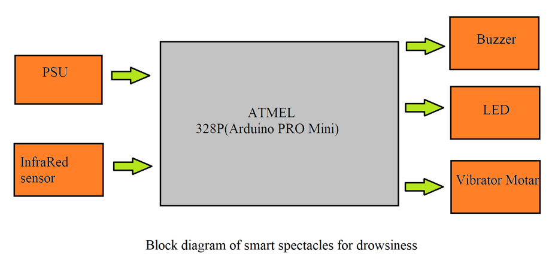
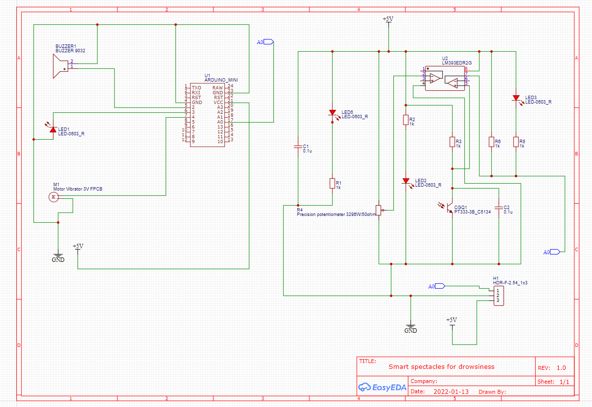

# Smart spectacles for drowsiness

Drowsiness is one of the major factors for road accidents. For preventing these kinds of accident from occurring and to alert the drivers there are many exiting systems which are designed using several methodologies. This Project is based on Drowsiness Detection system using InfraRed sensor. Here InfraRed based eye sensor is used to detect the eye blink of the drivers. The scope of this project is to implemented in car, truck, buses and many other vehicles.

This project firmware is based on Arduino.
## Components required for making this project

Hardware requirement

1-ATMEL 328P microcontroller (Arduino pro mini)

2-Infrared sensor

3-Buzzer

4-LED

5-Vibration motor

6-Fiber glass spectacles

7-Power source (battery 5volt)

8-Perf board

9-Wires and others materials

###

Software requirement

1-Arduino IDE

## Block diagram & Circuit diagram

</img>

In this block diagram firstly the whole system is powered by PSU (Power supply unit) after which it is start work. Here InfraRed based eye sensor is used to detect the eye blink of the driver. When the driver is not respond or do not open the eye after a certain interval of time, the sensor start acts and send the signal towards the microcontroller (Arduino Pro mini 328p) then the microcontroller analysed the data and send the further signal to the  “Buzzer, LED, Vibration motor” through which the driver or a person get alert.
This advantage leads to detecting drowsiness in early stages and activate the alarm before a car accident occur.


</img>

## Code for this project

```javascript
/*embed*/

#define SENSE A0
void setup()
{
pinMode(SENSE, INPUT);
pinMode(2, OUTPUT);
pinMode(LED_BUILTIN, OUTPUT);
}
void loop()
{
if(digitalRead(SENSE))
{
digitalWrite(LED_BUILTIN, LOW);
pinMode(2, LOW);
}
else
{
delay (3000);
if(digitalRead(SENSE))
{
digitalWrite(LED_BUILTIN, LOW);
pinMode(2, LOW);
}
else
digitalWrite(LED_BUILTIN, HIGH);
pinMode(2, HIGH);
}
}